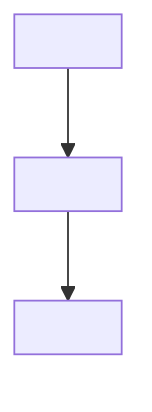
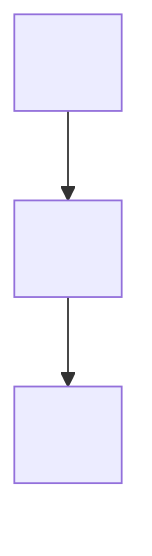

# Documentador de Processos

## Objetivo

Usar esta skill para operar o fluxo de mapeamento de codigo via MCP e transformar o mapeamento mecanico de uma base de codigo em documentacao final de processos em Markdown.

Esta deve ser uma unica skill. Nao criar uma skill separada apenas para iniciar o processo. O mesmo fluxo deve cobrir iniciar ou retomar o mapeamento, buscar o proximo item pendente, gerar o Markdown final e marcar o item como mapeado.

## Quando usar

Usar quando o agente precisar:

- mapear uma base de codigo usando o mapper MCP configurado;
- iniciar um job de mapeamento via MCP;
- acompanhar status de um job de mapeamento;
- buscar o proximo entrypoint/processo ainda nao documentado;
- transformar a documentacao mecanica em um documento final de negocio e tecnica;
- marcar um item como mapeado depois que o Markdown final estiver pronto.

## Ferramentas MCP esperadas

Usar estas tools do MCP server de mapeamento quando estiverem disponiveis:

- `start_mapping`
- `get_mapping_status`
- `get_mapping_result`
- `get_next_mapping_item`
- `get_mapping_item`
- `mark_mapping_item_mapped`

Se o MCP server nao estiver disponivel, informar que o mapper precisa estar rodando via stdio antes de executar o workflow.

## Addons

`addons` representa extensoes de linguagem, framework ou tecnologia que o mapper deve ativar durante o scan.

Exemplos:

- `spring` para aplicacoes Spring;
- `javaee` para aplicacoes Java EE/Jakarta EE legado, incluindo JAX-RS, JAX-WS,
  JSF/CDI, EJB, JPA, JMS/MDB, Servlets, Filters, JAAS, EAR/WAR e XHTML;
- `spring,javaee` ou `["spring","javaee"]` para bases mistas.

O default do mapper e `spring`. Nao tratar `spring` como obrigatorio no
workflow: usar o addon solicitado pelo usuario ou inferido com seguranca a
partir do repositorio. Quando nao houver certeza, pedir confirmacao ou usar a
configuracao padrao do mapper.

Referencia completa de parametros e valores: `docs/usage-parameters.md`.

## Fluxo da skill

### 1. Estabelecer o job de mapeamento

Se o usuario fornecer um `jobId`, chamar `get_mapping_status` e, quando estiver completo, `get_mapping_result`.

Se o usuario fornecer apenas o caminho do repositorio, chamar `start_mapping` com:

- `rootPath`: caminho da base de codigo;
- `outputDir`: diretorio onde os artefatos devem ser gerados;
- `addons`: lista de addons a ativar, por exemplo `["spring"]`, `["javaee"]`
  ou `["spring","javaee"]`;
- `javaVersion`: versao Java explicita quando informada pelo usuario, por
  exemplo `"8"`; omitir para usar a inferencia Maven/Gradle;
- `includeTests`: usar `false` por padrao, salvo quando o usuario pedir para incluir testes.

### 2. Aguardar o mapeamento mecanico

Chamar `get_mapping_status` ate o job ficar completo ou falhar.

Se falhar, retornar os erros do mapper e parar o fluxo.

Quando completar, chamar `get_mapping_result` e manter os paths dos artefatos como contexto de trabalho.

### 3. Buscar o proximo item pendente

Chamar `get_next_mapping_item` com:

```json
{
  "jobId": "<jobId>",
  "includeMechanicalMarkdown": true
}
```

Se a resposta indicar `done: true`, informar que nao ha entrypoints pendentes.

Se o usuario pedir um documento/entrypoint especifico, chamar `get_mapping_item`
em vez de `get_next_mapping_item`. Usar `entryPointId` quando disponivel; caso
contrario usar `entryPointName`, `title`, `documentPath`, `index` ou `query`.

```json
{
  "jobId": "<jobId>",
  "entryPointName": "<nome do entrypoint>",
  "includeMechanicalMarkdown": true
}
```

Se a resposta vier com `status: "ambiguous"`, apresentar os candidatos ao
usuario ou escolher pelo `entryPointId` quando a conversa ja deixar claro qual
item foi selecionado.

Se retornar um item, usar o pacote mecanico como fonte de evidencia:

- item retornado pela tool;
- `mechanicalMarkdown`;
- `graph.json`;
- `findings.json`;
- `traces.json`;
- arquivos fonte citados nas evidencias, quando necessario.

### 4. Gerar o Markdown final

Gerar um documento final em Markdown usando exatamente a estrutura definida em `Formato final do Markdown`.

O Markdown final deve ser escrito para uma pessoa que precisa entender o processo de negocio e sua implementacao tecnica.

Nao copiar a documentacao mecanica diretamente. Usar o mapeamento mecanico como evidencia para sintetizar o documento final.

Nao retornar JSON estruturado como resultado final. A saida que sera enviada para `mark_mapping_item_mapped` deve ser Markdown.

### 5. Marcar o item como mapeado

Chamar `mark_mapping_item_mapped` com:

```json
{
  "jobId": "<jobId>",
  "entryPointId": "<entryPointId>",
  "title": "<titulo final quando claro>",
  "markdown": "<documento final em Markdown>"
}
```

Deixar o mapper escolher o `finalDocPath` padrao, salvo quando o usuario pedir um caminho especifico.

Se o usuario pedir para continuar, repetir a partir de `get_next_mapping_item`.

## Regras de documentacao

- Usar apenas informacoes presentes nos artefatos do mapper ou nos arquivos fonte.
- Nao inventar nomes de produto, nomes de feature, dependencias ou comportamento.
- Separar informacoes encontradas, inferidas e ausentes.
- Marcar incertezas nos campos de confianca e em `Lacunas e incertezas`.
- Preservar evidencias como path, linha, simbolo, annotation, property e tipo de evidencia.
- Nunca resolver, imprimir ou inferir valores de variaveis de ambiente.
- Para placeholders como `${ENV_NAME}`, registrar `definido externamente`.
- Inferir nomes de feature a partir de rota, scheduler, listener, fila, comando, classe, metodo ou vocabulario de dominio apenas quando nao houver nome explicito.
- Incluir dependencias somente quando a evidencia mecanica ligar a dependencia ao processo selecionado, direta ou transitivamente.
- Diferenciar dependencia `direta` e `indireta`.
- Condicionais devem aparecer quando ajudam a explicar ramificacoes de negocio ou caminhos tecnicos relevantes.
- Incluir um diagrama de negocio em Mermaid logo apos o resumo para negocio.
- Incluir um diagrama tecnico em Mermaid no inicio do mapeamento tecnico, antes da entrada do processo.

## Formato final do Markdown

Usar esta estrutura e esta ordem de secoes para cada processo mapeado:

````md
# <titulo claro do processo>

## Produto
- Nome: <produto ou repositorio/modulo>
- Confianca: alta | media | baixa
- Fonte: encontrado | inferido | pendente
- Evidencias: <path:line ou referencia de artefato>

## Feature
- Nome: <nome da feature ou processo>
- Confianca: alta | media | baixa
- Fonte: encontrado | inferido | pendente
- Descricao curta: <uma ou duas frases>

## Resumo para negocio
<Explicar o que o processo faz em termos de negocio. Evitar detalhes de implementacao, exceto quando eles mudam o comportamento de negocio.>

## Diagrama de negocio


## Passo a passo de negocio
| Ordem | Passo | Entrada | Saida | Observacoes |
| --- | --- | --- | --- | --- |
| 1 | <acao de negocio> | <entrada> | <saida> | <observacoes/confianca> |

## Mapeamento tecnico
### Diagrama tecnico


### Entrada do processo
- Tipo: <HTTP | scheduler | listener | runner | batch | command | repository | method | other>
- Recurso: <rota, schedule, topico, comando, metodo ou trigger>
- Classe/modulo: <classe, modulo, pacote ou arquivo>
- Metodo/funcao: <metodo ou funcao>
- Evidencia: <path:line>

### Fluxo tecnico
| Ordem | Nivel | Origem | Acao | Destino | Condicao | Confianca | Evidencia |
| --- | --- | --- | --- | --- | --- | --- | --- |
| 1 | 0 | <origem> | chama | <destino/dependencia> | <if/else/switch/match quando relevante> | alta | <path:line> |

### Entradas aceitas
| Nome | Origem | Tipo | Obrigatorio | Evidencia |
| --- | --- | --- | --- | --- |

## Dependencias
### Banco de dados
| Dependencia | Acesso | Direta ou indireta | Origem tecnica | Evidencia |
| --- | --- | --- | --- | --- |

### Storage
| Dependencia | Bucket/recurso | Direta ou indireta | Origem tecnica | Evidencia |
| --- | --- | --- | --- | --- |

### APIs externas
| Dependencia | Operacao | Direta ou indireta | Origem tecnica | Evidencia |
| --- | --- | --- | --- | --- |

### Filas, topicos e eventos
| Dependencia | Operacao | Direta ou indireta | Origem tecnica | Evidencia |
| --- | --- | --- | --- | --- |

## Configuracoes
| Propriedade | Valor ou origem | Uso | Evidencia |
| --- | --- | --- | --- |

## Relacoes com outras features
| Feature/processo relacionado | Tipo de relacao | Confianca | Evidencia |
| --- | --- | --- | --- |

## Lacunas e incertezas
| Item | Motivo | Impacto | Proxima acao sugerida |
| --- | --- | --- | --- |
````

## Orientacao dos campos

- `Produto.Nome`: usar evidencia explicita quando existir. Se nao existir, inferir pelo repositorio ou modulo e marcar como `inferido`.
- `Feature.Nome`: inferir por rota, scheduler, listener, fila, comando, classe, metodo, funcao ou vocabulario de dominio quando nao houver nome explicito.
- `Diagrama de negocio`: representar o fluxo em termos de negocio, sem nomes tecnicos de classes, funcoes, tabelas ou infraestrutura, salvo quando forem termos conhecidos pelo usuario final.
- `Diagrama tecnico`: representar entrypoint, classes/modulos/funcoes, chamadas relevantes e dependencias, com uma descricao curta do papel de cada item.
- `Fluxo tecnico.Nivel`: usar `0` para o entrypoint, `1` para chamadas diretas e `2+` para chamadas transitivas.
- `Condicao`: incluir a linha do `if`, `else if`, `else`, `switch`, `match` ou equivalente quando a condicao muda o caminho tecnico ou a regra de negocio.
- `Direta ou indireta`: usar `direta` quando o componente/operacao selecionado acessa a dependencia; usar `indireta` quando aparece por chamada transitiva.
- `Valor ou origem`: nunca resolver variavel de ambiente; usar `definido externamente` para placeholders.
- Tabelas vazias sao permitidas, mas incluir uma linha `Nao identificado` quando a ausencia for relevante para revisao humana.
